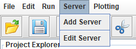
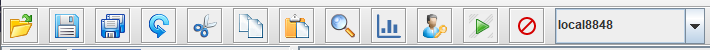

### 3.2 启动GUI

Linux环境中，执行以下指令以启动GUI：
```sh
sh gui.sh
```
Windows环境中，双击 gui.bat 以启动GUI。

如果DolphinDB GUI无法正常启动，可能有以下两个原因：

(1) 没有安装Java。

(2) 安装的Java版本不符合要求。DolphinDB GUI使用环境需要Java 8或以上版本，请在[Java官网](https://www.oracle.com/technetwork/java/javase/downloads/index.html)下载符合要求的版本。

### 3.3 启动GUI后的操作

根据提示，选择一个文件夹作为工作区。

点击菜单栏中的Server添加服务器或编辑服务器：




在工具栏的右侧是一个下拉窗口，可以切换服务器：


